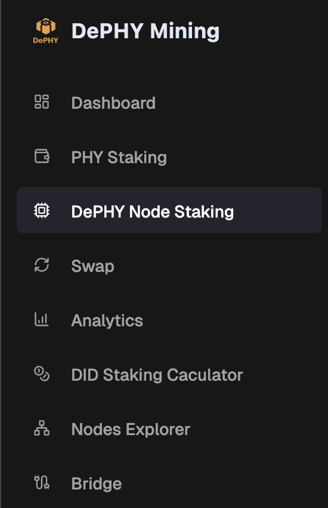

# Stake/Unstake PHY/stPHY to a Node

1. Navigate to [https://app.dephy.io/](https://app.dephy.io/)
2. Find _**DePHY Node Staking**_ in the navigation menu

<figure><figcaption></figcaption></figure>

3.  Click _**Manage**_ button on a DiD node

    <figure><figcaption></figcaption></figure>

4.  Change your options:

    1. 1️⃣ Stake or Unstake
    2. 2️⃣ PHY or stPHY
    3. 3️⃣ Input the amount

    <figure><figcaption></figcaption></figure>
