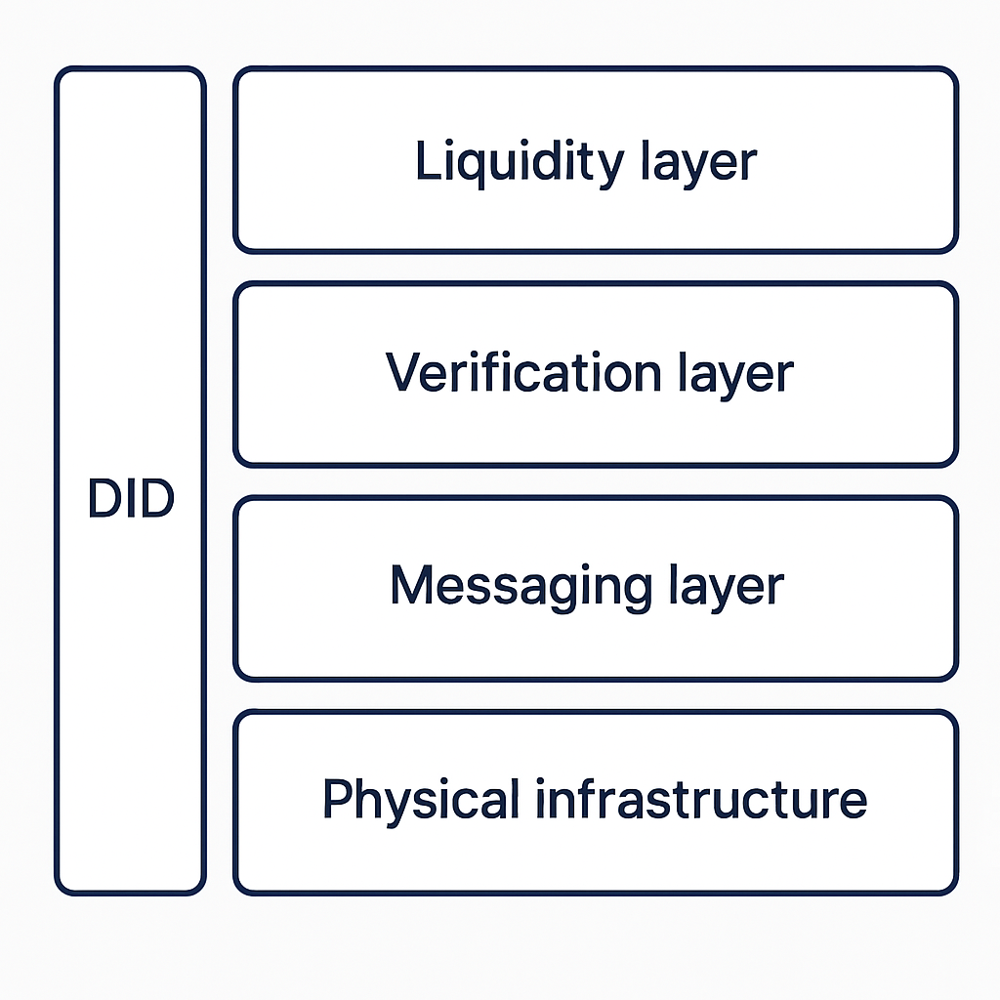

# Architecture

The DePHY protocol implements a sophisticated multi-layered architecture to address key challenges in the DePIN ecosystem. At its foundation lies the Physical Infrastructure Layer, which is built with physical nodes to provide exceptional performance characteristics including high throughput and minimal latency. This foundation supports DePIN functionality and modular AI security through innovative restaking mechanisms.

Above this foundation, the Messaging Layer utilizes Nostr technology to create a robust event bus system, facilitating seamless device interactions within decentralized IoT networks. This layer incorporates DID-based access control to ensure secure and authenticated communications.

The Verification Layer builds upon this by implementing merkle-tree-based verification mechanisms, with restaking shared security, guaranteeing data integrity and enabling comprehensive auditability while ensuring trustless operation of all network components.

At the highest level, the Liquidity Layer built on Solana establishes a decentralized financial infrastructure specifically optimized for DePIN ecosystems. Leveraging Solana's high-throughput architecture capable of processing 65,000 transactions per second with sub-second finality, this layer implements three core mechanisms: 1) A dynamic liquidity pool system supporting real-time resource tokenization of physical infrastructure assets; 2) Automated market makers (AMMs) enabling seamless conversion between DePIN-generated data credits and mainstream cryptocurrencies; 3) A decentralized oracle network that verifies physical infrastructure status updates through merkle-proof consensus. The layer's novel bonding curve design incorporates real-time device telemetry data to dynamically adjust token issuance rates, creating an adaptive economic model that aligns digital asset liquidity with physical infrastructure utilization.

The applications built on DePHY delivers comprehensive solutions that span hardware integration, data transmission, computation, and blockchain integration.

This sophisticated layered architecture enables DePHY to provide a complete solution for DePIN projects that combines low latency and minimal fees with verifiable inputs while maintaining rigorous security standards through its restaking mechanism.

<figure><figcaption></figcaption></figure>
